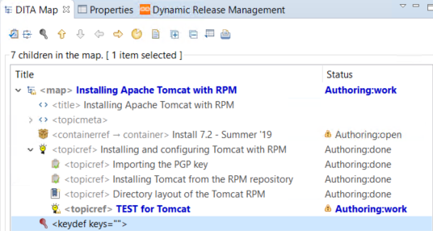

# Referencing objects and keys

The CCMS repository has a unique structure composed of reference objects and reference keys. There is no folder structure and so there is no intuitive way to navigate among files to create references based on structure.

## External cross reference

Just like normal Oxygen external URL linking.

Select the link icon in the Oxygen editor, then select __Web link__. Enter the URL. The attributes are set automatically.

## Internal cross reference

Place the cursor where you want to insert the cross reference. Select the topic from the search results that you want to insert. Right click the topic, then select __Oxygen Editor__ > __Insert Xref__.

## Referable content topics

Referable content topics are reusable snippets of content. There are available from the Referable content tab. To add a referable topic, it must be in the same library and version as the topic you are working on.

Referable content topics are unique, and they are searchable from the __Referable Content_ tab.

To insert the referable content, place the cursor where you want the referable content. Right-click the referable topic and select __Oxygen Editor__ > __Insert Conref__. The grey box around the conref is grey because to show that it is added to the topic from somewhere else.

## Keys

A key is a variable. Keys are defined by their keyref, and keyrefs are always defined at the map level.

### Example

A common example of when to use keys is for toggling a specific word in a context. For instance, I want key `A` to spell out `pdf` in one context and `html` in another.

To add a keydef to a map, right-click the map then click __Inset element__.

The keydef appears in the map. Double-click the new keydef to define it.