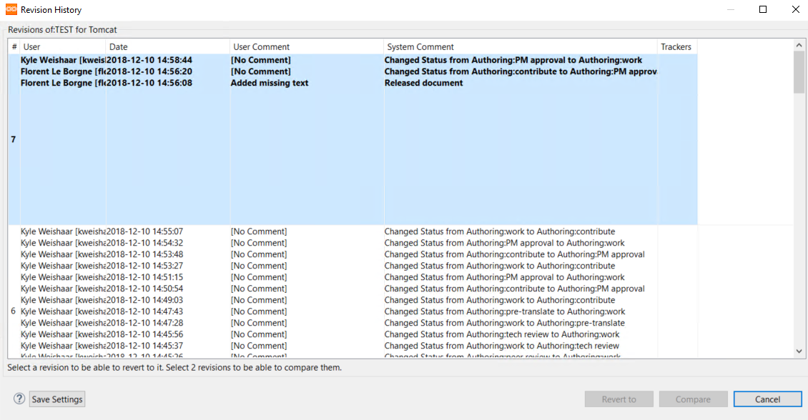
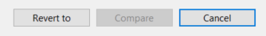

# Revision history

Like Git, CCMS keeps a revision history in the repository. To access the revision history dialog of an object, right-click and select __Revision History__.

revision history records the following:

- The author of the change.
- The date of the change.
- The user comment.
- The system comment (how the system changed).

When an object is not locked, when you click on a revision row in the revision history dialog, you have the option to __Revert to__ that version.

If the revert operation was successful, you'll see a confirmation message.

If you are familiar with git, then revert is easy to understand. A revert operation does not delete anything -- it is not a destructive process -- revert creates a new revision that does the line-by-line opposite of what was done in the revision from which you are reverting.