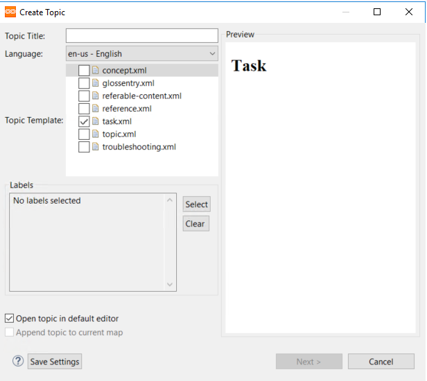
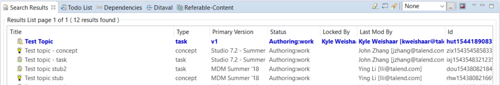
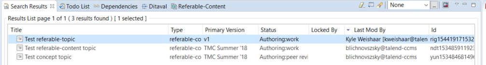
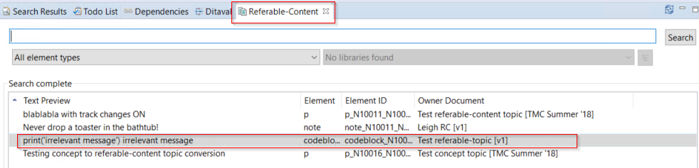
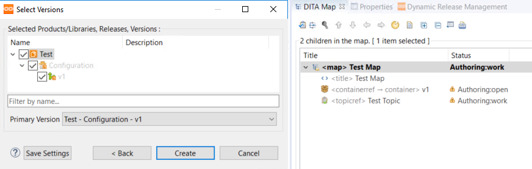

# Create a topic

You create topics from the toolbar by selecting __IXIASOFT CCMS__, then __Create Topic__, or from the icon toolbar. Topic templates are in a system configuration template folder. They are available to admins only.

The create topic dialog opens. Select the topic type and select __Open in default editor__.

You need to add the new topic to a library version. When you do this, the topic will have a primary version value of the version you select. The primary version has no special status, but each topic must have a primary version, which cannot be deleted.

If the topic exists in only one version, then the topic is the primary version. 

!!!Note
If you want to jump ahead to how the versions work, see [About products and libraries](#About-products-and-libraries).

## Editing and configuring the new topic

The topic opens in the main editing window in the Oxygen author view. You can start writing your topic.

When finished, click __Save__. You can close the topic after it has been saved. Your topic is immediately available through the CCMS search.

When you create a topic, it is automatically _locked_ to the user who creates it. You'll have to __release__ the topic. You can do this by right-clicking the topic and selecting __Release__. Now the topic is added to the repository and availble for all writers and admins.

## Referable-content topics

These topics are designed for snippets that can be referenced by other topics. You create referable topics the same way you create other topics.

These topics are searchable, just as normal topics are.

They are also searchable from a unique __Referable-Content__ window.

## Adding topics to maps

You can add topics to maps by dragging topics from the search results window onto an open map.

If a map is open in the DITA map viewer when you directly add the topic to the map by checking the __Append to current map__ option. This restricts the version of the new topic to the same version of the current map.

See [Create a map](./maps.md) for more information on maps.

