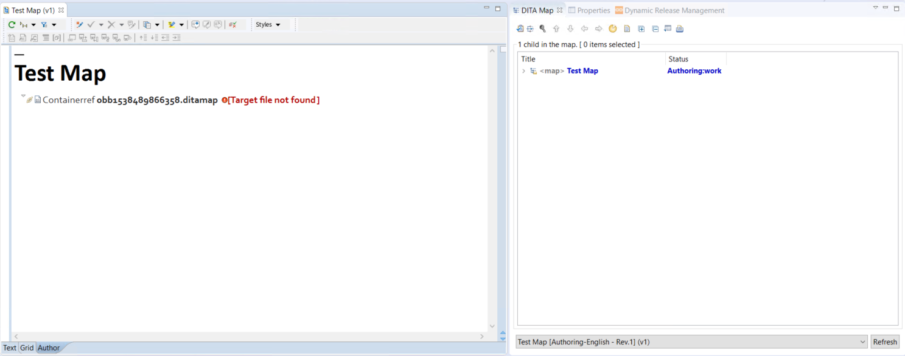

# Create a map

You create maps from the toolbar by selecting __IXIASOFT CCMS__, then __Create Map__, or from the icon toolbar. Map templates are in a system configuration template folder. They are available to admins only.

The create map dialog opens. Select the map type and select __Open in DITA map editor__.

You need to add the new map to a library version. When you do this, the map will have a primary version value of the version you select. The primary version has no special status, but each map must have a primary version, which cannot be deleted.

If the map exists in only one version, then the map is the primary version. 

!!!Note
If you want to jump ahead to how the versions work, see [About products and libraries](#About-products-and-libraries).

When you open the map, it opens in the DITA MAP viewer, but there are two views for DITA maps in CCMS. The window on the left is the DITA map editor, the window on the right is the DITA map editor.

