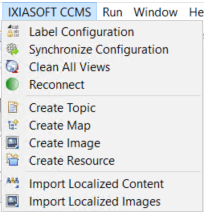
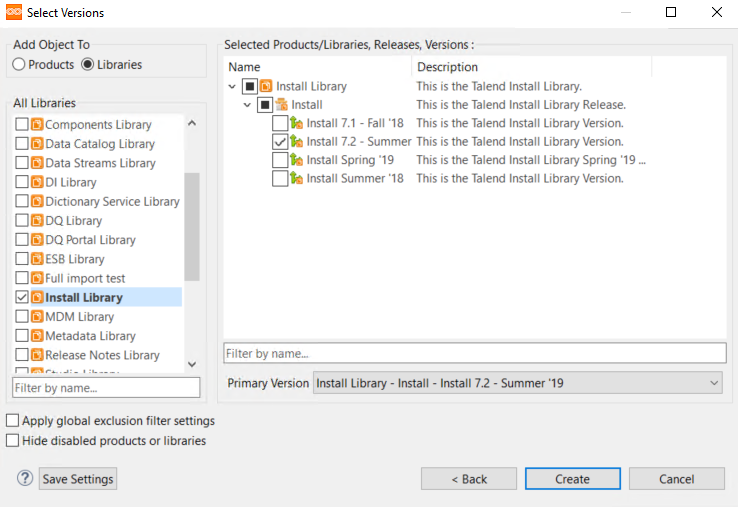
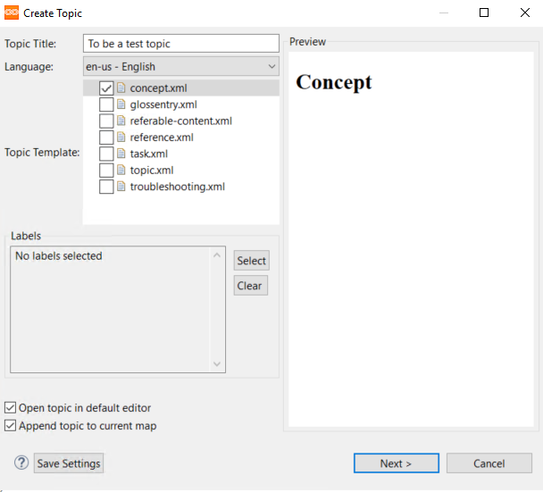
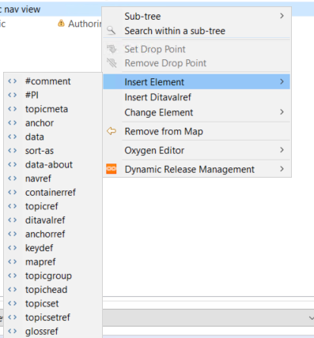
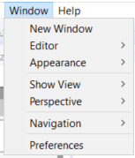
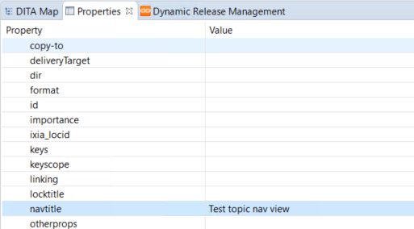

# Create a map

You create maps from the toolbar by selecting __IXIASOFT CCMS__, then __Create Map__, or from the icon toolbar. Map templates are in a system configuration template folder. They are available to admins only.

The create map dialog opens. Select the map type and select __Open in DITA map editor__.

You need to add the new map to a library version. When you do this, the map will have a primary version value of the version you select. The primary version has no special status, but each map must have a primary version, which cannot be deleted.

If the map exists in only one version, then the map is the primary version. 

!!!Note
If you want to jump ahead to how the versions work, see [About products and libraries](#About-products-and-libraries).

## Editing and configuring new maps

When you open the map, it opens in the DITA MAP viewer. You can start adding topics to the map. To do this, you can drag topics from the search onto the map. 

!!! Note
The map must be locked to add topics. If the map is locked but you still get an error message that says "The map is not locked", then you can refresh the map by clicking the __Refresh__ button on the bottom of the DITA map viewer.

You can organize topic heirarchy by dragging topics or by using the yellow arrows above the map. 

Another way to add topics to a map is in the __Create Topic__ dialog. Check the box __Append topic to current map__.

When you add a topic this way, the topic version is restricted to the same version as the current map.

### Elements and properties

You can add elements by right-clicking somewhere in the map and selecting __Add element__.

For example, you can add a `<tablehead>` element to the map. You can edit the meta data of map elements with the properties view. You can open the __Properties__ window from the __Show View__ menu.

From this view, you can add properties to map elements. Select a map element that you want to add a property to, then enter the value to the property.

