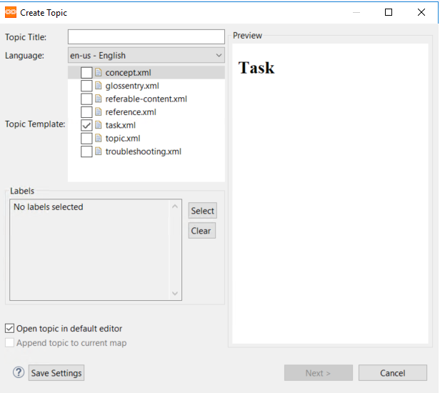
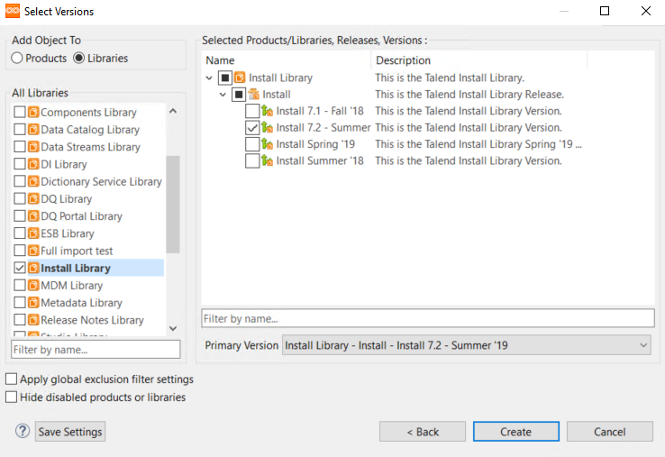
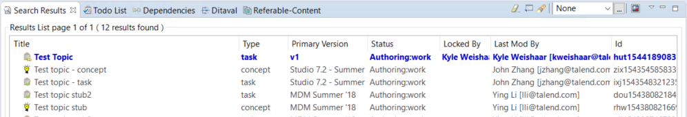
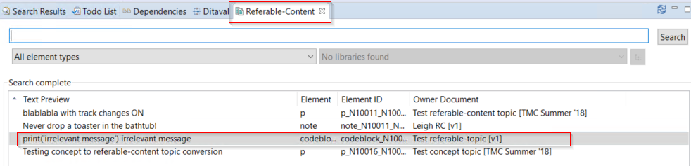

# My notes about DITA CCMS videos

!!! Note
Summary of Leigh's video

## The user interface

Eclipse-based UI. Lots of options come from the native Eclipse platform. Other options come from the CCMS.

### Perspectives

Perspectives comprise a set of views within the Eclipse UI. You can customize the UI by making custom perspectives. The DITA perspective is the most useful perspective for writers.

Your perspectives appear in the top-right corner. Save the perspective by right-clickng the perspective icon and selecting __Save As__.

### Views

Views compose a perspective. They let you edit, change, and select different properties within the Eclipse UI.

You can customize the views within a perspective from the __Window__ menu, under __Show Views__.

## Create a topic

You create topics from the toolbar by selecting __IXIASOFT CCMS__, then __Create Topic__.

The create topic dialog opens. Select the topic type and select __Open in default editor__.

You need to add the new topic to a library version. When you do this, the topic will have a primary version value of the version you select. The primary version has no special status, but each topic must have a primary version which cannot be deleted.

If the topic exists in only one version, then the unique topic is the primary version. 

!!!Note
If you want to jump ahead to how the versions work, see [About products and libraries](#About-products-and-libraries).

### Editing and configuring the new topic

The topic opens in the main editing window in the Oxygen author view. You can start writing your topic.

When finished, click __Save__. You can close the topic after it has been saved. Your topic is immediately available through the CCMS search.

When you create a topic, it is automatically _locked_ to the user who creates it. You'll have to __release__ the topic. You can do this by right-clicking the topic and selecting __Release__. Now the topic is added to the repository and availble for all writers and admins.

### Referable-content topics

These topics are designed for snippets that can be referenced by other topics. You create referable topics the same way you create other topics.

These topics are searchable, just as normal topics are.

They are also searchable from a unique __Referable-Content__ window.

## About products and libraries

We have two items under the product category: __On prem__ and __Cloud__. In our CCMS environment, you can think products as partitions of the repository. The __Cloud__ partion contains the libraries that contain objects related to the cloud release(s). The __On prem__ partition contains the libraries that contain the objects related to all other releases.

The libraries within each product contain the objects for a specific version within that product. CCMS libraries are meant to follow the architecture of the product documentation. This is why the libraries are named according to the specific product and product release cycle.

When you add new objects into the CCMS, you need to add it to the relevant product/library. How to read the table below:

- Find your the product area you are working on: cloud or on prem.
- Find the version your new topic or map needs corresponds to.
- Find the library version that you need to add the new topic or map to.

| Product   | Version relation to product   | To which library do I need to add my new topic/map? |
| ---       | ---       | ---                                           | --- |
| Cloud     | Spring '19| Spring '19              |
|           | Summer '19| 7.2 Summer '19              |
|           | Fall '19  | Fall '19              |
|           | Winter '20| 7.3 Winter '20              |
| On prem   | 7.2       |  7.2 - Summer '19             |
|           | 7.3       |  7.3 - Summer '20             |

!!! Note
There are more cloud releases that on prem release in a calendar year. This is the reason there are two combined libraries (7.2 - Summer '19 and 7.3 - Winter '20) which correspond to both cloud and on prem releases, and there are two unique libraries (Spring '19 and Fall '19) which correspond to unique cloud releases.  

## Search

CCMS is does not have a folder structure in the backend. Therefore, you cannot search topics and maps via a folder path.

To search for objects in the repository, you select filters and run queries in the search view.

The filters that you need to select to run a search are __Cycles__, __Document Types__, and __Language__.

### Cycles

Section of the repository.
    
Cycles are used to segragate the source documentation releavant to different tasks. For example, localization and authoring. Documents pass through different states inside of a cycle.

You can apply additional filters to cycles by clicking the area beside the checkbox in the cycles dialog.

### Search for

You can use search operators to filter search results. You can see the acceptable operators and their definitions by clikcing the blue question mark.

### Limit to ** selected items ...

This dialog lets you filter search results even further.

#### Example

With a DITA map open, under __Dependencies of__, select __DITA Map view__. When you run search with this option, you'll see a flat view of all dependencies of map. Then, you can sort dependencies by type rather that trying to search for objects in the map heirarchy.

### Advanced search

Provides full range of boolean operators for very specific search.

### Queries

Save queries here. Share saved queries.

## Dependencies

Right click on an object in the repository and select __Show Dependencies__. The __dependencies__ window opens. This window displays the parent, chile, and cross-referenced dependencies on any object in the reposity. 

You can use this feature to find maps for topics, the topics contained within a map, referenced images, etc. Before setting a map to __Status: Done__, all dependencies must be in the same state. 

    

