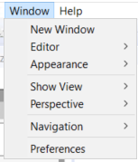

# The user interface

Eclipse-based UI. Lots of options come from the native Eclipse platform. Other options come from the CCMS.

## Perspectives

Perspectives comprise a set of views within the Eclipse UI. You can customize the UI by making custom perspectives. The DITA perspective is the most useful perspective for writers.

Your perspectives appear in the top-right corner. Save the perspective by right-clickng the perspective icon and selecting __Save As__.

## Views

Views compose a perspective. They let you edit, change, and select different properties within the Eclipse UI.

You can customize the views within a perspective from the __Window__ menu, under __Show Views__.

